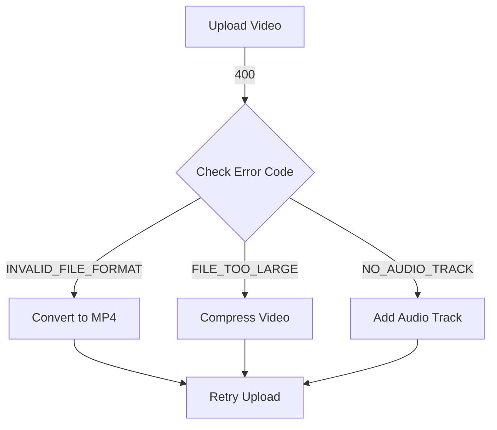
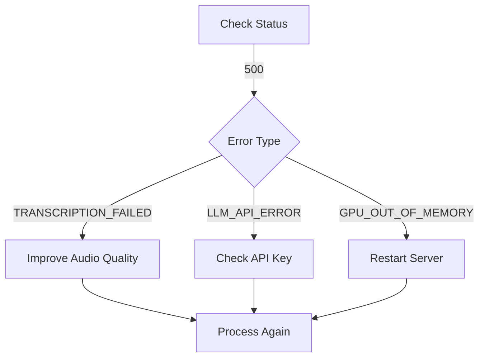

# Error Handling

Dokumentasi lengkap error codes dan cara mengatasinya.

---

## 📋 Error Response Format

Semua error mengikuti format standard:

```json
{
  "status": "error",
  "error": {
    "code": "ERROR_CODE",
    "message": "Human readable error message",
    "details": {
      // Additional context
    }
  },
  "timestamp": "2025-12-12T10:30:00Z",
  "request_id": "req_abc123"
}
```

---

## 🚨 HTTP Status Codes

| Status Code | Meaning           | Description                          |
| ----------- | ----------------- | ------------------------------------ |
| 200         | OK                | Request successful                   |
| 400         | Bad Request       | Invalid request parameters           |
| 404         | Not Found         | Resource not found                   |
| 413         | Payload Too Large | File size exceeds limit              |
| 429         | Too Many Requests | Rate limit exceeded                  |
| 500         | Internal Error    | Server error                         |
| 503         | Service Unavailable | Server overloaded                  |

---

## ❌ Error Codes

### File Upload Errors

#### `INVALID_FILE_FORMAT`

**Status Code:** 400

```json
{
  "error": {
    "code": "INVALID_FILE_FORMAT",
    "message": "Video file format not supported",
    "details": {
      "provided_format": "wmv",
      "supported_formats": ["mp4", "avi", "mov", "mkv"]
    }
  }
}
```

**Solution:** Convert video ke format yang supported.

---

#### `FILE_TOO_LARGE`

**Status Code:** 413

```json
{
  "error": {
    "code": "FILE_TOO_LARGE",
    "message": "Video file exceeds maximum size",
    "details": {
      "file_size_mb": 650,
      "max_size_mb": 500
    }
  }
}
```

**Solution:** Compress video atau gunakan video yang lebih pendek.

---

#### `VIDEO_TOO_LONG`

**Status Code:** 400

```json
{
  "error": {
    "code": "VIDEO_TOO_LONG",
    "message": "Video duration exceeds maximum",
    "details": {
      "duration_seconds": 4200,
      "max_duration_seconds": 3600
    }
  }
}
```

**Solution:** Trim video menjadi maksimal 60 menit.

---

#### `NO_AUDIO_TRACK`

**Status Code:** 400

```json
{
  "error": {
    "code": "NO_AUDIO_TRACK",
    "message": "Video does not contain audio track",
    "details": {
      "video_tracks": 1,
      "audio_tracks": 0
    }
  }
}
```

**Solution:** Pastikan video memiliki audio track.

---

#### `CORRUPTED_FILE`

**Status Code:** 400

```json
{
  "error": {
    "code": "CORRUPTED_FILE",
    "message": "Video file is corrupted or unreadable",
    "details": {
      "error_type": "codec_error"
    }
  }
}
```

**Solution:** Re-upload video atau gunakan video source yang berbeda.

---

### Language Errors

#### `INVALID_LANGUAGE`

**Status Code:** 400

```json
{
  "error": {
    "code": "INVALID_LANGUAGE",
    "message": "Language code not supported",
    "details": {
      "provided": "fr",
      "supported": ["en", "id"]
    }
  }
}
```

**Solution:** Gunakan language code `en` atau `id`.

---

### Session Errors

#### `SESSION_NOT_FOUND`

**Status Code:** 404

```json
{
  "error": {
    "code": "SESSION_NOT_FOUND",
    "message": "Session ID does not exist",
    "details": {
      "session_id": "invalid123"
    }
  }
}
```

**Solution:** Verifikasi session ID atau upload video baru.

---

#### `SESSION_EXPIRED`

**Status Code:** 410

```json
{
  "error": {
    "code": "SESSION_EXPIRED",
    "message": "Session has expired and been deleted",
    "details": {
      "session_id": "abc123",
      "expired_at": "2025-12-10T10:00:00Z",
      "retention_days": 7
    }
  }
}
```

**Solution:** Upload dan process video lagi.

---

#### `PROCESSING_IN_PROGRESS`

**Status Code:** 409

```json
{
  "error": {
    "code": "PROCESSING_IN_PROGRESS",
    "message": "Session is still being processed",
    "details": {
      "current_stage": "transcription",
      "progress_percentage": 45
    }
  }
}
```

**Solution:** Wait sampai processing selesai, poll `/status/{session_id}`.

---

### Processing Errors

#### `TRANSCRIPTION_FAILED`

**Status Code:** 500

```json
{
  "error": {
    "code": "TRANSCRIPTION_FAILED",
    "message": "Speech-to-text processing failed",
    "details": {
      "reason": "Audio quality too low",
      "suggestions": [
        "Use clearer audio recording",
        "Reduce background noise"
      ]
    }
  }
}
```

**Solution:** Upload video dengan audio quality yang lebih baik.

---

#### `LLM_API_ERROR`

**Status Code:** 503

```json
{
  "error": {
    "code": "LLM_API_ERROR",
    "message": "LLM service unavailable",
    "details": {
      "provider": "huggingface",
      "error": "Rate limit exceeded"
    }
  }
}
```

**Solution:** 
- Check Hugging Face API key
- Wait beberapa menit dan retry
- Check quota API

---

#### `GPU_OUT_OF_MEMORY`

**Status Code:** 500

```json
{
  "error": {
    "code": "GPU_OUT_OF_MEMORY",
    "message": "GPU memory insufficient",
    "details": {
      "required_memory_gb": 8,
      "available_memory_gb": 4
    }
  }
}
```

**Solution:** 
- Restart server
- Use smaller video
- Process dengan CPU (lebih lambat)

---

### Rate Limit Errors

#### `RATE_LIMIT_EXCEEDED`

**Status Code:** 429

```json
{
  "error": {
    "code": "RATE_LIMIT_EXCEEDED",
    "message": "Too many requests",
    "details": {
      "limit": 10,
      "window": "1 hour",
      "retry_after_seconds": 3600
    }
  }
}
```

**Solution:** Wait sesuai `retry_after_seconds` sebelum request lagi.

---

### Configuration Errors

#### `MISSING_API_KEY`

**Status Code:** 500

```json
{
  "error": {
    "code": "MISSING_API_KEY",
    "message": "Required API key not configured",
    "details": {
      "missing_key": "DEEPL_API_KEY",
      "required_for": "translation"
    }
  }
}
```

**Solution:** Configure API key di `.env` file.

---

#### `INVALID_API_KEY`

**Status Code:** 401

```json
{
  "error": {
    "code": "INVALID_API_KEY",
    "message": "API key is invalid or expired",
    "details": {
      "key_type": "HUGGINGFACE_API_KEY"
    }
  }
}
```

**Solution:** Update API key dengan yang valid.

---

## 🔧 Error Handling Best Practices

### 1. Retry Logic

```python
import time
import requests
from requests.adapters import HTTPAdapter
from requests.packages.urllib3.util.retry import Retry

def create_session_with_retries():
    session = requests.Session()
    retry = Retry(
        total=3,
        backoff_factor=1,
        status_forcelist=[429, 500, 502, 503, 504]
    )
    adapter = HTTPAdapter(max_retries=retry)
    session.mount('http://', adapter)
    session.mount('https://', adapter)
    return session

# Usage
session = create_session_with_retries()
response = session.post(url, files=files, data=data)
```

---

### 2. Graceful Error Handling

```python
def upload_video(file_path, language):
    try:
        with open(file_path, 'rb') as f:
            files = {'file': f}
            data = {'language': language}
            
            response = requests.post(
                'http://localhost:8000/upload',
                files=files,
                data=data,
                timeout=300
            )
            
            response.raise_for_status()
            return response.json()
            
    except requests.exceptions.Timeout:
        print("⏱️ Upload timeout - file might be too large")
        return None
        
    except requests.exceptions.HTTPError as e:
        error_data = e.response.json()
        print(f"❌ Error: {error_data['error']['message']}")
        
        # Handle specific errors
        if error_data['error']['code'] == 'FILE_TOO_LARGE':
            print("💡 Try compressing the video first")
        elif error_data['error']['code'] == 'INVALID_LANGUAGE':
            print("💡 Use 'en' or 'id' for language")
            
        return None
        
    except Exception as e:
        print(f"🔴 Unexpected error: {e}")
        return None
```

---

### 3. Status Polling with Error Handling

```python
def wait_for_results(session_id, timeout=600):
    """
    Poll for results with timeout and error handling
    """
    start_time = time.time()
    poll_interval = 5
    
    while time.time() - start_time < timeout:
        try:
            response = requests.get(
                f'http://localhost:8000/status/{session_id}',
                timeout=10
            )
            response.raise_for_status()
            
            data = response.json()
            status = data['status']
            
            if status == 'completed':
                return get_results(session_id)
            elif status == 'failed':
                print(f"❌ Processing failed: {data.get('error')}")
                return None
            else:
                progress = data.get('progress', {}).get('percentage', 0)
                print(f"⏳ Processing: {progress}%")
                
        except requests.exceptions.RequestException as e:
            print(f"⚠️ Poll error: {e}")
            
        time.sleep(poll_interval)
    
    print("⏱️ Timeout waiting for results")
    return None
```

---

## 📊 Common Error Scenarios

### Scenario 1: File Upload Fails



### Scenario 2: Processing Fails



---

## 🔍 Debugging Tips

### Enable Verbose Logging

```python
import logging

logging.basicConfig(level=logging.DEBUG)
```

### Check Response Headers

```python
response = requests.post(url, files=files)
print(f"Status Code: {response.status_code}")
print(f"Headers: {response.headers}")
print(f"Response: {response.text}")
```

### Validate File Before Upload

```python
import os
from pathlib import Path

def validate_video(file_path):
    """Pre-upload validation"""
    path = Path(file_path)
    
    # Check exists
    if not path.exists():
        return False, "File not found"
    
    # Check format
    if path.suffix.lower() not in ['.mp4', '.avi', '.mov', '.mkv']:
        return False, f"Invalid format: {path.suffix}"
    
    # Check size
    size_mb = os.path.getsize(file_path) / (1024 * 1024)
    if size_mb > 500:
        return False, f"File too large: {size_mb:.1f} MB"
    
    return True, "Valid"

# Usage
is_valid, message = validate_video('interview.mp4')
if not is_valid:
    print(f"❌ {message}")
```

---

## 📞 Getting Help

Jika error masih berlanjut:

1. Check [Troubleshooting Guide](../troubleshooting/common-issues.md)
2. Review [Configuration](../configuration/advanced.md)
3. Check server logs
4. Open GitHub issue dengan error details

---

## 📚 See Also

- [API Endpoints](endpoints.md)
- [Request/Response Format](request-response.md)
- [Common Issues](../troubleshooting/common-issues.md)
