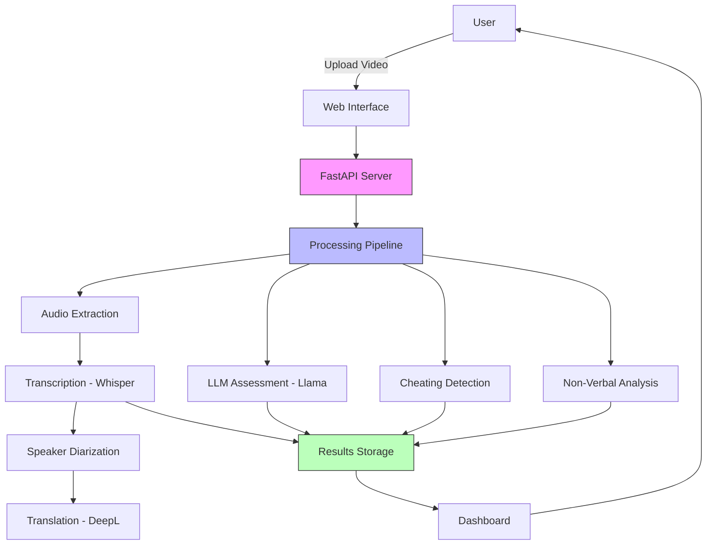
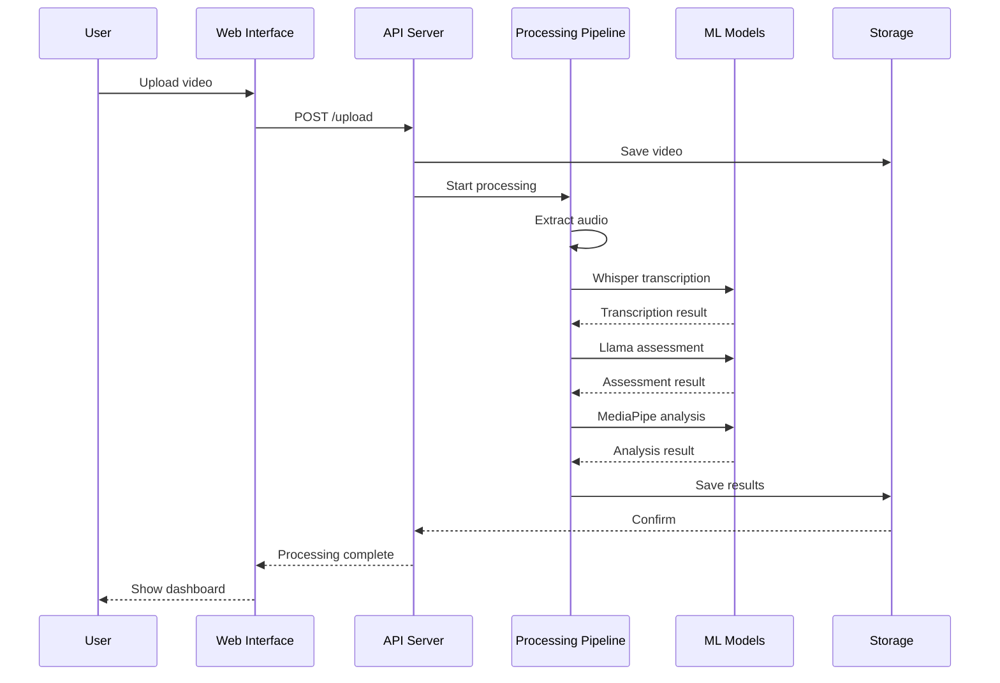
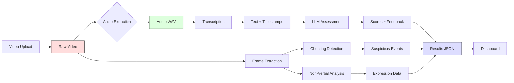
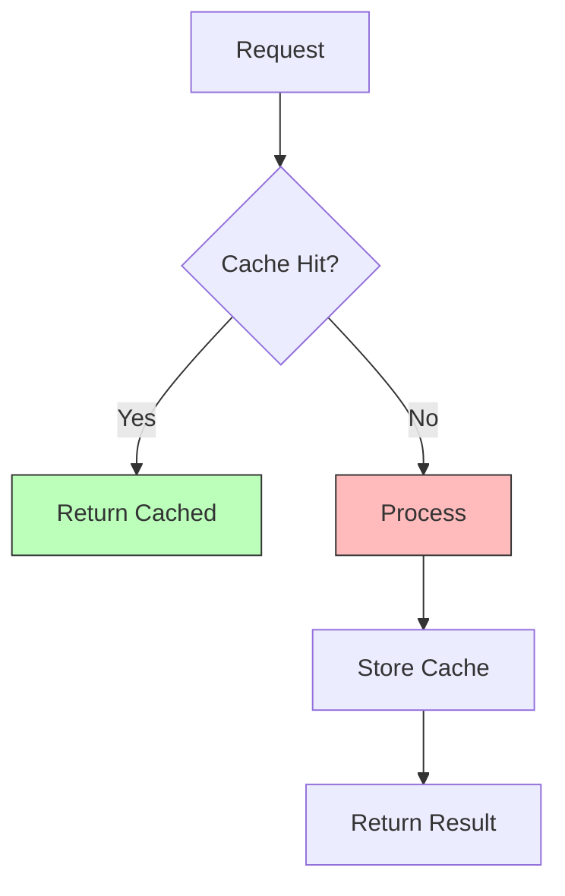
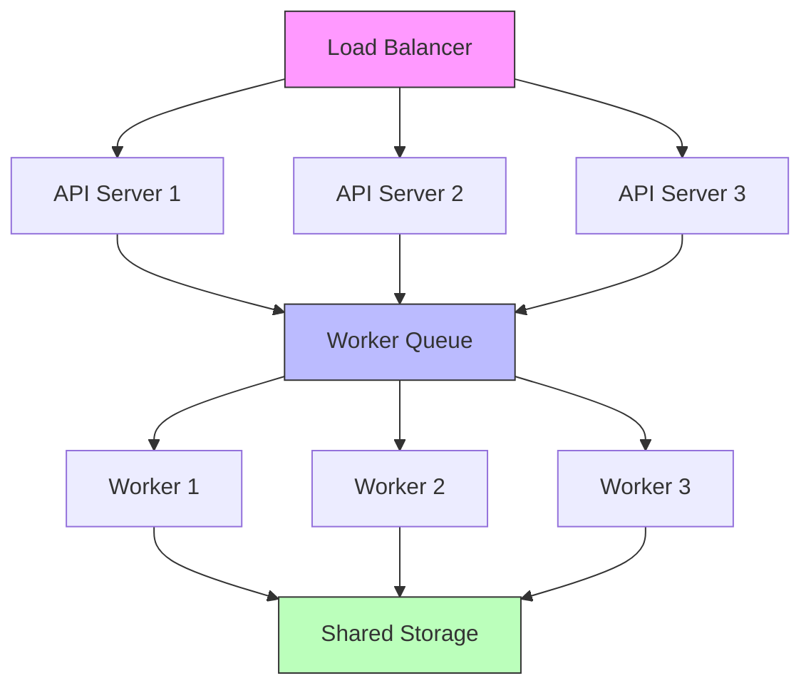
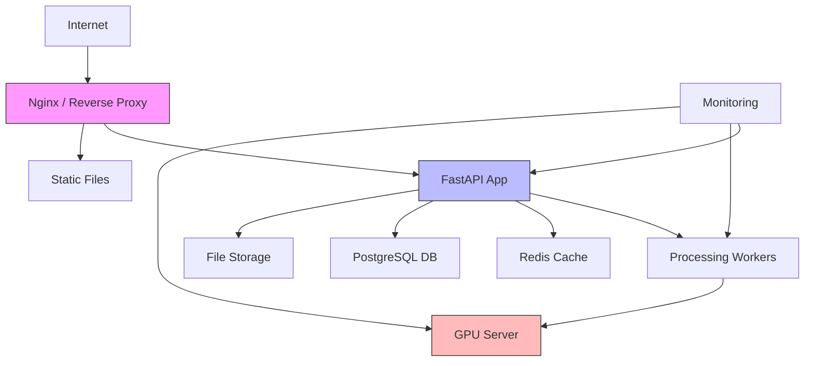

# System Architecture

Arsitektur dan design sistem Interview Assessment.

---

## 🏗️ High-Level Architecture



---

## 📦 Component Overview

### 1. **Frontend (Web Interface)**
- **Technology:** HTML5, CSS3, JavaScript
- **Purpose:** Upload interface, dashboard, visualization
- **Files:** 
  - `Upload.html` - Video upload form
  - `Halaman_dasboard.html` - Results dashboard

### 2. **Backend (FastAPI Server)**
- **Technology:** FastAPI, Python 3.11
- **Purpose:** API endpoints, request handling
- **Key Features:**
  - RESTful API
  - Async processing
  - Session management
  - Error handling

### 3. **Processing Pipeline**
- **Technology:** Jupyter Notebook (`payload_video.ipynb`)
- **Purpose:** Core video processing logic
- **Stages:**
  1. Audio extraction (FFmpeg)
  2. Transcription (Whisper)
  3. Speaker diarization (Resemblyzer)
  4. Translation (DeepL)
  5. LLM assessment (Llama 3.1)
  6. Cheating detection (MediaPipe + CV)
  7. Non-verbal analysis (MediaPipe)

### 4. **Storage Layer**
- **Technology:** Local filesystem + Google Drive (optional)
- **Folders:**
  - `uploads/` - Uploaded videos
  - `results/` - JSON results
  - `transcriptions/` - Text transcripts
  - `temp/` - Temporary files

---

## 🔄 Processing Flow



---

## 🧩 Detailed Component Architecture

### FastAPI Server

```python
app/
├── main.py                 # FastAPI app initialization
├── routers/
│   ├── upload.py          # Upload endpoints
│   ├── results.py         # Results endpoints
│   └── status.py          # Status endpoints
├── models/
│   ├── video.py           # Video data models
│   └── assessment.py      # Assessment models
├── services/
│   ├── processor.py       # Processing orchestration
│   ├── storage.py         # File storage
│   └── session.py         # Session management
└── utils/
    ├── validation.py      # Input validation
    └── helpers.py         # Helper functions
```

### Processing Pipeline

```python
pipeline/
├── audio_extraction.py    # FFmpeg wrapper
├── transcription.py       # Whisper integration
├── diarization.py         # Speaker separation
├── translation.py         # DeepL integration
├── llm_assessment.py      # LLM analysis
├── cheating_detection.py  # Visual analysis
└── nonverbal_analysis.py  # Expression analysis
```

---

## 🤖 ML Model Integration

### 1. Whisper (Speech-to-Text)

```python
from transformers import pipeline

class WhisperTranscriber:
    def __init__(self, model="openai/whisper-large-v3"):
        self.pipe = pipeline(
            "automatic-speech-recognition",
            model=model,
            device="cuda" if torch.cuda.is_available() else "cpu"
        )
    
    def transcribe(self, audio_path, language="en"):
        result = self.pipe(
            audio_path,
            return_timestamps=True,
            generate_kwargs={"language": language}
        )
        return result
```

### 2. Llama 3.1 (LLM Assessment)

```python
from huggingface_hub import InferenceClient

class LlamaAssessor:
    def __init__(self, api_key):
        self.client = InferenceClient(token=api_key)
        self.model = "meta-llama/Llama-3.1-8B-Instruct"
    
    def assess(self, transcription):
        prompt = self.build_prompt(transcription)
        response = self.client.text_generation(
            prompt,
            model=self.model,
            max_new_tokens=2048
        )
        return self.parse_response(response)
```

### 3. MediaPipe (Visual Analysis)

```python
import mediapipe as mp

class VisualAnalyzer:
    def __init__(self):
        self.face_mesh = mp.solutions.face_mesh.FaceMesh(
            max_num_faces=2,
            refine_landmarks=True,
            min_detection_confidence=0.5
        )
    
    def analyze_frame(self, frame):
        results = self.face_mesh.process(frame)
        return self.extract_features(results)
```

---

## 💾 Data Flow Architecture



---

## 🔐 Security Architecture

### Authentication & Authorization
```python
# Future: API Key authentication
from fastapi import Security, HTTPException
from fastapi.security import APIKeyHeader

api_key_header = APIKeyHeader(name="X-API-Key")

def validate_api_key(api_key: str = Security(api_key_header)):
    if api_key not in valid_api_keys:
        raise HTTPException(status_code=403, detail="Invalid API Key")
    return api_key
```

### Input Validation
```python
from pydantic import BaseModel, validator

class VideoUpload(BaseModel):
    language: str
    
    @validator('language')
    def validate_language(cls, v):
        if v not in ['en', 'id']:
            raise ValueError('Invalid language code')
        return v
    
    @validator('file')
    def validate_file_size(cls, v):
        if v.size > 500 * 1024 * 1024:  # 500 MB
            raise ValueError('File too large')
        return v
```

---

## ⚡ Performance Architecture

### Caching Strategy



### Async Processing

```python
from fastapi import BackgroundTasks

@app.post("/upload")
async def upload(
    file: UploadFile,
    background_tasks: BackgroundTasks
):
    # Save file immediately
    session_id = save_file(file)
    
    # Process in background
    background_tasks.add_task(process_video, session_id)
    
    return {"session_id": session_id, "status": "processing"}
```

---

## 📊 Monitoring & Logging

### Logging Architecture

```python
import logging
from logging.handlers import RotatingFileHandler

# Setup structured logging
logging.basicConfig(
    level=logging.INFO,
    format='%(asctime)s - %(name)s - %(levelname)s - %(message)s',
    handlers=[
        RotatingFileHandler('logs/app.log', maxBytes=10MB, backupCount=5),
        logging.StreamHandler()
    ]
)

# Log events
logger = logging.getLogger(__name__)
logger.info(f"Processing started: {session_id}")
```

### Metrics Collection

```python
from prometheus_client import Counter, Histogram

# Define metrics
upload_counter = Counter('videos_uploaded', 'Total videos uploaded')
processing_time = Histogram('processing_seconds', 'Processing duration')

# Track metrics
with processing_time.time():
    process_video(session_id)
upload_counter.inc()
```

---

## 🔄 Scalability Considerations

### Horizontal Scaling



### Worker Queue System

```python
from celery import Celery

app = Celery('tasks', broker='redis://localhost:6379')

@app.task
def process_video_async(session_id):
    """Process video in background worker"""
    result = process_video(session_id)
    save_results(session_id, result)
    return result
```

---

## 🗄️ Database Schema (Future)

```sql
-- Users table
CREATE TABLE users (
    id UUID PRIMARY KEY,
    email VARCHAR(255) UNIQUE,
    api_key VARCHAR(255),
    created_at TIMESTAMP
);

-- Sessions table
CREATE TABLE sessions (
    id UUID PRIMARY KEY,
    user_id UUID REFERENCES users(id),
    filename VARCHAR(255),
    status VARCHAR(50),
    created_at TIMESTAMP,
    completed_at TIMESTAMP
);

-- Results table
CREATE TABLE results (
    id UUID PRIMARY KEY,
    session_id UUID REFERENCES sessions(id),
    transcription TEXT,
    assessment JSONB,
    cheating_data JSONB,
    nonverbal_data JSONB
);
```

---

## 🔌 API Integration Points

### External APIs

1. **Hugging Face Inference API**
   - Purpose: LLM assessment
   - Protocol: REST
   - Auth: Bearer token

2. **DeepL Translation API**
   - Purpose: EN↔ID translation
   - Protocol: REST
   - Auth: API key

3. **Google Drive API** (Optional)
   - Purpose: Backup storage
   - Protocol: REST
   - Auth: OAuth 2.0

---

## 📱 Frontend Architecture

### Component Structure

```
frontend/
├── upload/
│   ├── drag-drop.js       # Drag & drop
│   ├── validation.js      # Client validation
│   └── progress.js        # Upload progress
├── dashboard/
│   ├── transcription.js   # Transcription view
│   ├── assessment.js      # Assessment view
│   ├── cheating.js        # Cheating view
│   └── charts.js          # Visualizations
└── common/
    ├── api.js             # API client
    └── utils.js           # Utilities
```

---

## 🚀 Deployment Architecture

### Production Setup



---

## 📚 Technology Stack Summary

| Layer | Technologies |
|-------|-------------|
| **Frontend** | HTML5, CSS3, Vanilla JS |
| **Backend** | FastAPI, Python 3.11, Uvicorn |
| **ML Models** | Whisper, Llama 3.1, MediaPipe, Resemblyzer |
| **Storage** | Local FS, Google Drive (optional) |
| **Processing** | FFmpeg, PyTorch, OpenCV |
| **APIs** | Hugging Face, DeepL |
| **Deployment** | Docker, Nginx, systemd |

---

## 🔮 Future Architecture Improvements

1. **Microservices:** Split into independent services
2. **Message Queue:** RabbitMQ/Redis for async processing
3. **Database:** PostgreSQL for persistent storage
4. **Containerization:** Full Docker/Kubernetes setup
5. **CDN:** Static asset delivery
6. **WebSockets:** Real-time status updates

---

## 📚 See Also

- [Contributing Guide](contributing.md)
- [API Documentation](../api/endpoints.md)
- [Configuration](../configuration/advanced.md)
