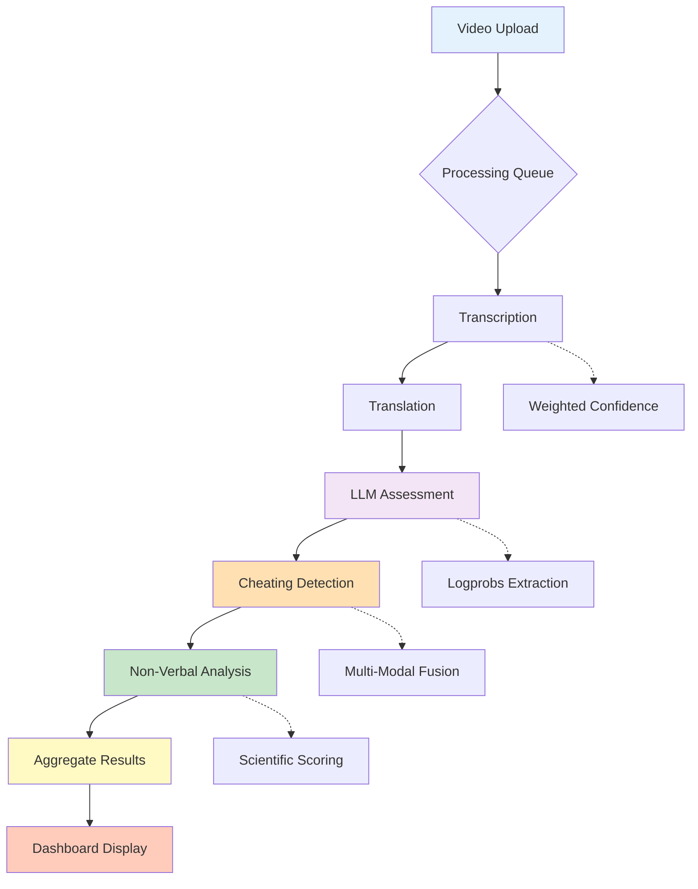

# Features Overview

The AI Interview Assessment System combines multiple cutting-edge AI technologies to provide comprehensive candidate evaluation.

## Core Features

### :material-microphone: Speech-to-Text Transcription

Automatic conversion of interview videos to accurate text using OpenAI's Whisper model.

**Key Capabilities:**
- 98% accuracy for clear audio
- Multi-language support (English, Indonesian)
- Voice Activity Detection (VAD)
- Weighted confidence scoring
- Logprobs extraction

[Learn More →](../getting-started/introduction.md)

---

### :material-robot: LLM-Powered Assessment

Semantic evaluation of candidate answers using Hugging Face's Llama 3.1-8B-Instruct model.

**Key Capabilities:**
- Answer quality analysis
- Coherence and relevance scoring
- Context-aware evaluation
- Confidence-based score boosting
- Batch summary generation

[Learn More →](../getting-started/introduction.md)

---

### :material-shield-alert: Cheating Detection

Multi-modal system to detect suspicious behavior during interviews.

**Visual Detection:**
- Face tracking and counting
- Eye gaze monitoring
- Head pose analysis
- Suspicious frame identification

**Audio Detection:**
- Speaker diarization
- Voice embedding analysis
- Multiple speaker identification

[Learn More →](../getting-started/introduction.md)

---

### :material-account-eye: Non-Verbal Analysis

Scientific assessment of candidate's non-verbal communication and behavior.

**Analysis Components:**
- Facial expressions (smile, eyebrow movement)
- Eye movement (blink rate, eye contact)
- Speech patterns (tempo, pauses, speaking ratio)
- Z-score normalization with reliability weighting

[Learn More →](../getting-started/introduction.md)

---

### :material-translate: Bilingual Translation

Automatic translation between English and Indonesian using DeepL API.

**Features:**
- 98%+ translation quality
- Bidirectional support (EN↔ID)
- Automatic language detection
- Chunked processing for long texts
- Fallback to original if API unavailable

---

### :material-chart-line: Dashboard & Reporting

Interactive dashboard for viewing and exporting assessment results.

**Dashboard Features:**
- Overview cards with key metrics
- Per-video detailed breakdowns
- Aggregate summaries
- Interactive charts (Chart.js)
- PDF export functionality
- JSON download

[Learn More →](../getting-started/quickstart.md)

---

## Workflow Integration



---

## Feature Matrix

| Feature                  | Status | Accuracy | Speed      | Dependencies        |
| ------------------------ | ------ | -------- | ---------- | ------------------- |
| Transcription            | ✅      | ~98%     | Fast       | Whisper, FFmpeg     |
| Translation              | ✅      | ~98%     | Very Fast  | DeepL API           |
| LLM Assessment           | ✅      | 50-95%   | Fast       | Hugging Face API    |
| Cheating (Visual)        | ✅      | ~92%     | Moderate   | MediaPipe, OpenCV   |
| Cheating (Audio)         | ✅      | 60-95%   | Moderate   | Resemblyzer, FFmpeg |
| Non-Verbal (Facial)      | ✅      | 70-90%   | Moderate   | MediaPipe           |
| Non-Verbal (Speech)      | ✅      | 80-95%   | Fast       | PyDub               |
| Dashboard                | ✅      | N/A      | Instant    | Chart.js            |
| PDF Export               | ✅      | N/A      | Fast       | Browser API         |
| Google Drive Integration | ✅      | N/A      | Moderate   | gdown               |

---

## Performance Characteristics

### Processing Time (per video)

| Component            | CPU Time   | GPU Time   | Notes                          |
| -------------------- | ---------- | ---------- | ------------------------------ |
| Transcription        | 45-90s     | 15-30s     | Depends on audio duration      |
| Translation          | 2-5s       | 2-5s       | API call, network dependent    |
| LLM Assessment       | 10-20s     | 10-20s     | API call, rate-limited         |
| Cheating (Visual)    | 30-120s    | 15-60s     | Frame-by-frame analysis        |
| Cheating (Audio)     | 20-60s     | 15-45s     | Voice embedding + clustering   |
| Non-Verbal           | 30-90s     | 20-60s     | Multiple analysis components   |
| **Total**            | **3-8 min**| **1-3 min**| End-to-end per video           |

### Accuracy Factors

**High Accuracy Scenarios:**
- Clear audio with minimal background noise
- Well-lit video with face clearly visible
- Single speaker throughout
- Adequate video resolution (720p+)
- Professional interview setting

**Reduced Accuracy Scenarios:**
- Poor audio quality or heavy background noise
- Low lighting or face obscured
- Very fast or unclear speech
- Low video resolution (<480p)
- Multiple speakers or people in frame

---

## Feature Configuration

Each feature can be customized through configuration files. See [Configuration Guide](../configuration/models.md) for details.

### Quick Configuration Examples

**Adjust Transcription Quality:**
```python
beam_size = 10  # Higher = more accurate (slower)
temperature = 0.0  # Deterministic
```

**Adjust Cheating Sensitivity:**
```python
SCORE_HIGH_RISK = 20.0  # % threshold
SCORE_MEDIUM_RISK = 5.0
```

**Adjust Non-Verbal Weights:**
```python
WEIGHTS = {
    "speech_rate_wpm": 0.26,
    "speaking_ratio": 0.24,
    # ...
}
```

---

## API Integration

All features are accessible via RESTful API:

```bash
# Upload and process
POST /upload

# Check status
GET /status/{session_id}

# Get results
GET /results/{session_id}

# Download from Google Drive
POST /download-and-upload
```

[API Reference →](../api/endpoints.md)

---

## Limitations & Considerations

!!! warning "Current Limitations"
    - LLM assessment requires active internet connection
    - Free tier API keys have rate limits
    - GPU significantly improves processing speed
    - Very long videos (>30 min) may timeout
    - Cheating detection accuracy varies with video quality

!!! tip "Best Practices"
    - Use consistent lighting and framing
    - Minimize background noise
    - Test with sample videos first
    - Monitor API usage quotas
    - Consider GPU for production use

---

## Roadmap

See our [Development Roadmap](../development/roadmap.md) for upcoming features and improvements.

---

## Next Steps

Explore individual features in detail:

- [Getting Started Guide](../getting-started/introduction.md)
- [Quick Start Tutorial](../getting-started/quickstart.md)
- [API Reference](../api/endpoints.md)
- [Configuration Guide](../configuration/models.md)
