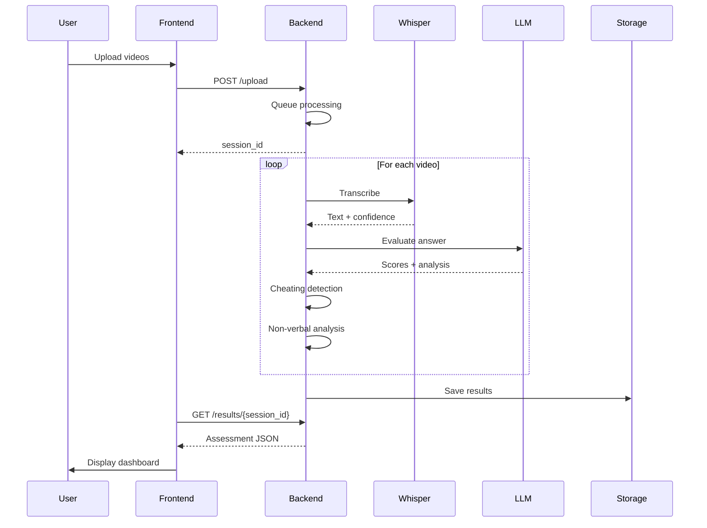

# Introduction

Welcome to the **AI Interview Assessment System** documentation! This comprehensive guide will help you understand, install, and use the system effectively.

## What is AI Interview Assessment System?

The AI Interview Assessment System is an end-to-end platform for automating candidate interview evaluation using cutting-edge AI technologies. It combines multiple AI models and techniques to provide:

- **Accurate transcription** of interview videos
- **Semantic assessment** of candidate answers
- **Cheating detection** through multi-modal analysis
- **Non-verbal analysis** of candidate behavior
- **Comprehensive reporting** with actionable insights

---

## Key Capabilities

### :material-microphone: Speech-to-Text Transcription

Uses OpenAI's Whisper large-v3 model to transcribe interview videos with ~98% accuracy. Features include:

- Multi-language support (English/Indonesian)
- Voice Activity Detection (VAD) for noise filtering
- Weighted confidence scoring
- Logprobs extraction for quality metrics

### :material-robot: LLM-Powered Assessment

Leverages Hugging Face's Llama 3.1-8B-Instruct for semantic evaluation:

- Answer quality analysis
- Coherence and relevance scoring
- Context-aware evaluation
- Confidence-based score boosting

### :material-shield-alert: Cheating Detection

Multi-modal approach combining visual and audio analysis:

**Visual Detection:**
- Face detection and tracking
- Eye gaze monitoring
- Head pose analysis
- Multiple face detection

**Audio Detection:**
- Speaker diarization
- Voice embedding analysis
- Multiple speaker identification

### :material-account-eye: Non-Verbal Analysis

Scientific scoring of non-verbal communication:

- Facial expressions (smile intensity, eyebrow movement)
- Eye contact and blink rate
- Speech patterns (tempo, pauses, speaking ratio)
- Z-score normalization with reliability weighting

---

## How It Works



---

## Use Cases

### :material-briefcase: Corporate Hiring

- Automate first-round screening
- Standardize evaluation criteria
- Reduce interviewer bias
- Scale interview capacity

### :material-school: Educational Assessments

- Online exam proctoring
- Speaking proficiency tests
- Course completion evaluations
- Student engagement analysis

### :material-domain: Remote Interviews

- Asynchronous video interviews
- Multi-location candidate pools
- 24/7 availability
- Consistent evaluation standards

---

## System Requirements

### Minimum Requirements

- **OS:** Windows 10, macOS 10.15+, or Linux
- **Python:** 3.11
- **RAM:** 8GB (16GB recommended)
- **Storage:** 10GB free space (for models)
- **Internet:** Stable connection for API calls

### Recommended Specs

- **CPU:** Intel i5/i7 or AMD Ryzen 5/7
- **GPU:** NVIDIA GPU with CUDA support (optional, 5-10x faster)
- **RAM:** 16GB+
- **Storage:** SSD with 20GB+ free space

---

## What's Included

```
Interview_Assesment_System-ngrok-raifal/
├── payload_video.ipynb      # Backend server (Jupyter Notebook)
├── Upload.html              # Video upload interface
├── Halaman_dasboard.html    # Results dashboard
├── README.md                # Project documentation
├── mkdocs.yml               # This documentation config
├── docs/                    # Documentation source files
├── Assest/                  # Static assets
├── bin/                     # Binary files
├── transcriptions/          # Saved transcripts
└── results/                 # Assessment results (JSON)
```

---

## Getting Help

- **Documentation:** You're reading it! Check the navigation menu for specific topics.
- **GitHub Issues:** Report bugs or request features
- **Community:** Join our discussions
- **Email Support:** contact@example.com

---

## Next Steps

Ready to get started? Follow our installation guide:

[Installation Guide](installation.md){ .md-button .md-button--primary }
