# Quick Start Guide

Get up and running with the AI Interview Assessment System in minutes!

## Prerequisites Checklist

- [x] System installed ([Installation Guide](installation.md))
- [x] Backend server running (port 8888)
- [x] Frontend server running (port 5500)
- [x] API keys configured (DeepL + Hugging Face)

---

## Your First Assessment

### Step 1: Open Upload Interface

Navigate to `http://localhost:5500/Upload.html` in your browser.


### Step 2: Enter Candidate Information

```
Candidate Name: John Doe
```

### Step 3: Upload Videos

You have two options:

=== "Local File Upload"

    1. Click "Choose Files" or drag & drop
    2. Select video files (`.mp4`, `.webm`, `.avi`)
    3. Multiple videos supported (up to 5 recommended)
    
    **Supported formats:**
    - MP4 (H.264)
    - WebM (VP8/VP9)
    - AVI
    - MOV

=== "Google Drive URL"

    Use the API endpoint for Google Drive videos:
    
    ```bash
    POST /download-and-upload
    Content-Type: application/json
    
    {
      "candidate_name": "John Doe",
      "interviews": [
        {
          "positionId": 1,
          "question": "Tell me about yourself",
          "isVideoExist": true,
          "recordedVideoUrl": "https://drive.google.com/file/d/FILE_ID/view"
        }
      ],
      "language": "en"
    }
    ```

### Step 4: Add Question Context

For each video, you can specify:

```json
{
  "positionId": 1,
  "question": "Tell me about your experience with Python",
  "isVideoExist": true
}
```

### Step 5: Select Language

Choose the primary language of the interview:

- **English** (`en`) - Default
- **Indonesian** (`id`) - Bahasa Indonesia

!!! tip "Language Selection"
    System will transcribe in the selected language and translate to the other automatically via DeepL.

### Step 6: Submit & Monitor

1. Click **"Kirim Video"** (Submit)
2. You'll receive a `session_id`
3. Frontend automatically polls `/status/{session_id}` every 5 seconds
4. Monitor progress in real-time

---

## Processing Stages

Your video goes through these stages:

```mermaid
graph LR
    A[Upload] --> B[Queue]
    B --> C[Transcription]
    C --> D[Translation]
    D --> E[LLM Assessment]
    E --> F[Cheating Detection]
    F --> G[Non-Verbal Analysis]
    G --> H[Save Results]
    H --> I[Dashboard Ready]
    
    style A fill:#e3f2fd
    style E fill:#f3e5f5
    style F fill:#ffe0b2
    style G fill:#c8e6c9
    style I fill:#ffccbc
```



### Expected Timeline (per video)

| Stage                  | Duration (CPU) | Duration (GPU) |
| ---------------------- | -------------- | -------------- |
| Upload & Queue         | 5-10s          | 5-10s          |
| Transcription          | 45-90s         | 15-30s         |
| Translation            | 2-5s           | 2-5s           |
| LLM Assessment         | 10-20s         | 10-20s         |
| Cheating Detection     | 30-120s        | 15-60s         |
| Non-Verbal Analysis    | 30-90s         | 20-60s         |
| **Total**              | **3-8 min**    | **1-3 min**    |

---

## View Results

### Auto-Redirect

Once processing completes, you'll be automatically redirected to:

```
http://localhost:5500/halaman_dasboard.html?session=abc123...
```

### Dashboard Components

The dashboard displays:

#### 1. **Overview Card**
- Candidate name
- Processing timestamp
- Total videos processed
- Final decision (Lulus/Tidak Lulus)

#### 2. **Aggregate Scores**
- LLM Assessment (Quality, Coherence, Relevance)
- Non-Verbal Performance
- Cheating Detection Summary

#### 3. **Per-Video Details**

For each video:

=== "Transcription Tab"

    - **English Transcription** (original or translated)
    - **Indonesian Translation**
    - **Confidence Score** with min/max range
    - **Word count** and processing metadata

=== "Assessment Tab"

    - **LLM Scores:**
        - Answer Quality: 0-100
        - Coherence: 0-100
        - Relevance: 0-100
        - Total: Average of above
    - **LLM Analysis:** Brief qualitative feedback
    - **Logprobs Confidence:** Model certainty (50-95%)

=== "Cheating Detection Tab"

    - **Visual Analysis:**
        - Cheating Score: 0-100%
        - Suspicious Frames count
        - Eye gaze issues
        - Head pose issues
        - Multiple face detection
    - **Audio Analysis:**
        - Number of speakers detected
        - Confidence: 60-95%
        - Silhouette score
    - **Final Verdict:** Safe / Medium Risk / High Risk

=== "Non-Verbal Tab"

    - **Speech Analysis:**
        - Speaking ratio (speech vs silence)
        - Speech rate (words per minute)
        - Pause frequency
    - **Facial Expression:**
        - Smile intensity
        - Eyebrow movement range
    - **Eye Movement:**
        - Blink rate per minute
        - Eye contact percentage
    - **Confidence Score:** 50-90%

#### 4. **Aggregate Summary**

- **Cheating Report:** Combined verdict across all videos
- **Non-Verbal Report:** Overall performance status
- **LLM Summary:** Comprehensive 150-200 word analysis

#### 5. **Export Options**

- **Download JSON:** Raw assessment data
- **Download PDF:** Formatted report

---

## API Status Monitoring

Monitor processing status via API:

```bash
GET http://localhost:8888/status/{session_id}
```

**Response (Processing):**
```json
{
  "status": "processing",
  "progress": "2/3",
  "message": "Transcribing video 2/3...",
  "current_video": 2
}
```

**Response (Completed):**
```json
{
  "status": "completed",
  "redirect": "halaman_dasboard.html?session=abc123",
  "result": {
    "success": true,
    "successful_videos": 3
  }
}
```

---

## Example Workflow

### Scenario: Hiring Python Developer

**Step 1:** Prepare 3 interview questions
- Q1: "Tell me about your Python experience"
- Q2: "Explain async programming"
- Q3: "How would you optimize this code?"

**Step 2:** Candidate records video answers

**Step 3:** Upload all 3 videos with metadata

**Step 4:** System processes (~6-15 minutes for 3 videos)

**Step 5:** Review dashboard results:
- Transcripts show candidate used technical terms correctly
- LLM scores show high relevance (85+)
- Cheating detection: Safe (1 speaker, no issues)
- Non-verbal: Good confidence (75+)

**Step 6:** Make hiring decision based on comprehensive data

---

## Tips for Best Results

### Video Quality

!!! success "Best Practices"
    - **Resolution:** Minimum 480p, recommended 720p+
    - **Lighting:** Adequate illumination of face
    - **Audio:** Clear voice, minimal background noise
    - **Framing:** Face visible in >80% of frames
    - **Duration:** 30 seconds to 10 minutes per video

### Question Design

- Be specific and relevant to the position
- Allow sufficient time for thoughtful answers (2-5 min)
- Avoid yes/no questions
- Include both technical and behavioral questions

### Language Selection

- Choose the candidate's primary language for transcription
- System will auto-translate for bilingual reports
- English generally has higher LLM assessment accuracy

---

## Troubleshooting Quick Tips

### Video Upload Fails

- Check file size (< 100MB recommended)
- Verify format is supported
- Ensure stable internet connection

### Processing Stuck

- Check Jupyter Notebook logs
- Verify all API keys are valid
- Restart backend server if needed

### Low Confidence Scores

- Improve video/audio quality
- Ensure face is clearly visible
- Check for background noise
- Verify adequate lighting

---

## Next Steps

Now that you've completed your first assessment, learn more about:

- [Features Overview](../features/overview.md) - Deep dive into all capabilities
- [API Reference](../api/endpoints.md) - Complete API documentation
- [Configuration](../configuration/models.md) - Customize model settings

[Explore Features](../features/overview.md){ .md-button .md-button--primary }
