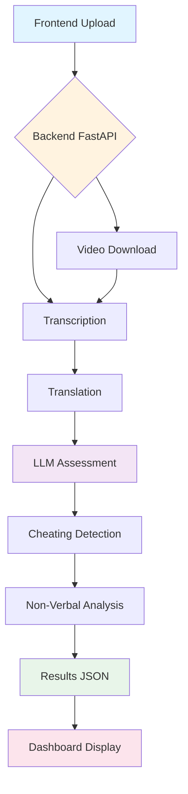

# AI Interview Assessment System


## :material-star: Key Features

<div class="grid cards" markdown>

-   :material-microphone:{ .lg .middle } __98% Accurate Transcription__

    ---

    Faster-Whisper large-v3 dengan weighted confidence + logprobs untuk hasil transcription berkualitas tinggi.

    [:octicons-arrow-right-24: Learn more](getting-started/introduction.md)

-   :material-robot:{ .lg .middle } __LLM Assessment__

    ---

    Hugging Face Llama 3.1-8B untuk semantic answer evaluation dengan confidence scoring.

    [:octicons-arrow-right-24: Learn more](getting-started/introduction.md)

-   :material-shield-check:{ .lg .middle } __Cheating Detection__

    ---

    Multi-modal detection: Visual (face/eye tracking) + Audio (speaker diarization).

    [:octicons-arrow-right-24: Learn more](getting-started/introduction.md)

-   :material-account-eye:{ .lg .middle } __Non-Verbal Analysis__

    ---

    Scientific scoring untuk facial expressions, eye contact, dan speech patterns.

    [:octicons-arrow-right-24: Learn more](getting-started/introduction.md)

-   :material-translate:{ .lg .middle } __Bilingual Support__

    ---

    English ↔ Indonesian translation via DeepL API dengan 98%+ accuracy.

    [:octicons-arrow-right-24: Learn more](features/overview.md)

-   :material-chart-line:{ .lg .middle } __Dashboard Analytics__

    ---

    Interactive charts, PDF export, dan comprehensive reporting.

    [:octicons-arrow-right-24: Learn more](getting-started/quickstart.md)

</div>

---

## :material-rocket-launch: Quick Demo

```bash
# 1. Clone & setup
git clone <repo>
cd Interview_Assesment_System-ngrok-raifal
python -m venv .venv && .venv\Scripts\activate

# 2. Install dependencies
pip install -r requirements.txt

# 3. Start server
jupyter notebook payload_video.ipynb
# Run all cells → Server starts on http://localhost:8888

# 4. Open frontend
# http://localhost:5500/Upload.html (via Live Server)
```

---

## :material-chart-box: System Architecture



---

## :material-speedometer: Performance Metrics

| Metric                         | Value                      |
| ------------------------------ | -------------------------- |
| Transcription Accuracy         | ~98% (clear audio)         |
| Translation Quality            | ~98% (DeepL API)           |
| LLM Assessment Confidence      | 50-95%                     |
| Cheating Detection Accuracy    | ~92% (visual + audio)      |
| Non-Verbal Confidence          | 50-90%                     |
| Processing Speed (CPU)         | 3-8 min/video              |
| Processing Speed (GPU)         | 1-3 min/video              |
| Storage Saved                  | 99%+ (auto-cleanup)        |

---

## :material-tools: Technology Stack

=== "Backend"

    - **FastAPI** - Modern async web framework
    - **faster-whisper** (large-v3) - Speech-to-text
    - **Hugging Face** - LLM assessment (Llama 3.1-8B)
    - **DeepL API** - Neural machine translation
    - **MediaPipe** - Face mesh detection (468 landmarks)
    - **Resemblyzer** - Voice embeddings (speaker diarization)
    - **PyTorch** - Deep learning framework

=== "Frontend"

    - **Vanilla JavaScript** - No framework overhead
    - **Chart.js** - Data visualization
    - **HTML5** - Drag & drop file upload
    - **CSS3** - Responsive design

=== "AI Models"

    - **Whisper large-v3** (~3GB) - OpenAI's SOTA speech recognition
    - **Llama 3.1-8B-Instruct** - Meta's LLM for evaluation
    - **MediaPipe Face Mesh** - 468-point facial landmarks
    - **Resemblyzer GE2E** - Speaker embedding network (~50MB)

---

## :material-format-list-checks: What's Next?

<div class="grid cards" markdown>

-   :material-download:{ .lg .middle } __Install__

    ---

    Get started with installation and setup.

    [:octicons-arrow-right-24: Installation Guide](getting-started/installation.md)

-   :material-book-open-variant:{ .lg .middle } __Learn__

    ---

    Explore all features and capabilities.

    [:octicons-arrow-right-24: Features Overview](features/overview.md)

-   :material-api:{ .lg .middle } __API Reference__

    ---

    Complete API documentation with examples.

    [:octicons-arrow-right-24: API Docs](api/endpoints.md)

-   :material-wrench:{ .lg .middle } __Configure__

    ---

    Customize models and settings.

    [:octicons-arrow-right-24: Configuration](configuration/models.md)

</div>

---

## :material-license: License

This project is licensed under the MIT License - see the [LICENSE](about/license.md) page for details.

---

## :material-help-circle: Support

- :material-github: [GitHub Issues](https://github.com/yourusername/Interview_Assesment_System-ngrok-raifal/issues)
- :material-book: [Documentation](getting-started/introduction.md)
- :material-email: [Contact Us](mailto:your-email@example.com)
